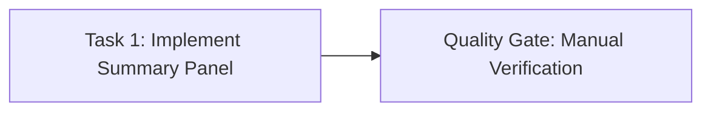
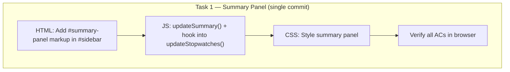

# Work Plan: Live Summary Panel in Right Sidebar

**Scale**: Small (Score <= 0.4 — 3 files, single feature, no architecture changes)
**Approach**: Vertical Slice — single task delivering the complete user-facing feature
**Verification Level**: L1 (Functional Operation — feature works end-to-end in the browser)
**Date**: 2026-02-14

---

## Phase Structure Diagram



## Task Dependency Diagram



---

## Task 1: Implement Live Summary Panel

> **Files**: `index.html`, `multiple-stopwatches_script.js`, `multiple-stopwatches_style.css`
> **Verification**: L1 — open the app, start/stop/clear timers, confirm summary updates live

### Implementation Checklist

- [ ] **1.1 HTML — Add summary panel markup** (`index.html`)
  - Add `<div id="summary-panel">` inside `#sidebar`, after the existing `<button id="delete-macro-button">` (below macro keybinds section)
  - Structure:
    ```html
    <div id="summary-panel">
      <h2>Summary</h2>
      <div id="summary-rows"></div>
      <div id="summary-total"></div>
    </div>
    ```
  - `#summary-rows`: container for individual timer rows (populated by JS)
  - `#summary-total`: container for the total row (populated by JS)

- [ ] **1.2 JS — Create `updateSummary()` function** (`multiple-stopwatches_script.js`)
  - Declare `let lastSummaryUpdate = 0;` at top-level for throttling
  - Get references: `const summaryRows = document.getElementById('summary-rows');` and `const summaryTotal = document.getElementById('summary-total');`
  - Implement `updateSummary()`:
    1. Throttle: if `Date.now() - lastSummaryUpdate < 250`, return early
    2. Update `lastSummaryUpdate = Date.now()`
    3. Iterate `stopwatchArray`, for each entry with a `.stopwatch` (skip finalBlock entry):
       - Compute elapsed: if `.timeButton.classList.contains('going')` → `prevTime + (Date.now() - startTime) / 1000`, else → `parseTimeToSeconds(timeButton.textContent)`
       - Skip if elapsed is `0` (never started)
       - Collect `{ name, seconds }` into an array
    4. Build `#summary-rows` innerHTML: one `<div class="summary-row">` per qualifying timer showing `<span class="summary-name">{name}</span><span class="summary-time">{formatTime(seconds)}</span>`
    5. Compute `totalSeconds` = sum of all qualifying timers' seconds
    6. Format total:
       - HH:MM format: `Math.floor(totalSeconds / 3600)` padded to 2 digits + `:` + `Math.floor((totalSeconds % 3600) / 60)` padded to 2 digits (e.g., `"02:35"`)
       - Human-readable: `"Xh Ym"` (e.g., `"2h 35m"`) — omit hours part if 0 (just `"Ym"`), omit minutes part if 0 (just `"Xh"`)
    7. Build `#summary-total` innerHTML: `<div class="summary-row summary-total-row"><span class="summary-name">Total</span><span class="summary-time">{HH:MM}</span></div><div class="summary-human-total">{Xh Ym}</div>`
    8. If no qualifying timers, clear both `#summary-rows` and `#summary-total` (show nothing or show "No timers")

- [ ] **1.3 JS — Hook `updateSummary()` into the update loop** (`multiple-stopwatches_script.js`)
  - Add `updateSummary();` call at the end of `updateStopwatches()` function
  - This leverages the existing 10ms `setInterval`; the 250ms throttle inside `updateSummary()` prevents DOM thrash
  - Also call `updateSummary()` from event handlers that change timer state outside the running loop:
    - `clear()` — after a timer is cleared
    - `removeStopwatch()` — after a timer is removed
    - `addStopwatch()` — after a timer is added
    - `restoreFromState()` — after state is restored from localStorage
    - `nameChangeEvent()` — when a timer name changes
  - For these event-driven calls, bypass the throttle by resetting `lastSummaryUpdate = 0` before calling, so the panel updates immediately

- [ ] **1.4 CSS — Style the summary panel** (`multiple-stopwatches_style.css`)
  - `#summary-panel`: top margin to separate from macro section, top border for visual separation
  - `#summary-panel h2`: consistent with existing `h1` style but smaller (e.g., `1.1em`)
  - `.summary-row`: flexbox row with `justify-content: space-between`, small vertical padding
  - `.summary-name`: text-overflow ellipsis for long names, max-width constraint
  - `.summary-time`: `font-variant-numeric: tabular-nums` for stable widths (matches existing `.time button`)
  - `.summary-total-row`: bold, top border to separate from individual rows
  - `.summary-human-total`: smaller font, muted color, right-aligned

- [ ] **1.5 Verify all acceptance criteria in browser**
  - [ ] AC1: Summary panel appears in right sidebar below macro keybinds
  - [ ] AC2: Each timer with elapsed time > 0 shows its name and current time
  - [ ] AC3: Timers with 0 elapsed time are hidden from summary
  - [ ] AC4: Total row shows combined time in HH:MM format + "Xh Ym" human-readable
  - [ ] AC5: Summary updates live while timers are running
  - [ ] AC6: Summary updates when timers are added, removed, started, stopped, or cleared
  - [ ] AC7: No performance degradation (throttled updates)

### Completion Criteria

| Element | Criteria |
|---------|----------|
| **Implementation** | All 4 sub-steps (HTML, JS function, JS hooks, CSS) complete |
| **Quality** | No console errors, no visual regressions in existing sidebar |
| **Integration** | Summary reacts to all stopwatch lifecycle events (add, remove, start, stop, clear, rename) |

### Risks & Mitigations

| Risk | Likelihood | Impact | Mitigation |
|------|-----------|--------|------------|
| DOM thrash from frequent innerHTML rebuilds | Low | Medium | 250ms throttle on `updateSummary()` |
| Long timer names overflow sidebar | Low | Low | CSS `text-overflow: ellipsis` with `overflow: hidden` |
| Summary out of sync after clear/remove | Low | Medium | Explicit `updateSummary()` calls in event handlers with throttle bypass |

---

## Quality Checklist

- [ ] All 7 acceptance criteria verified in browser
- [ ] No console errors or warnings introduced
- [ ] Existing macro keybinds section unaffected
- [ ] Summary panel responds correctly with 0, 1, and many timers
- [ ] Page load with saved state shows correct summary
